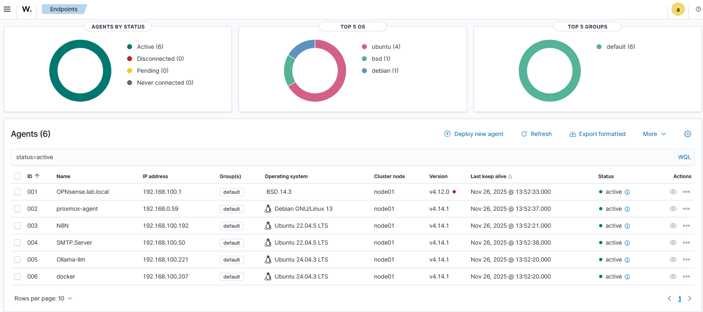
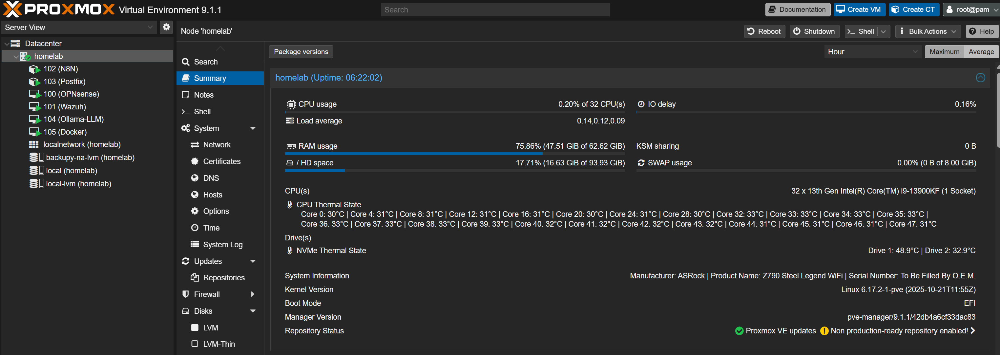

# Homelab
Witaj w dokumentacji mojego domowego laboratorium. Ten projekt służy mi do nauki cyberbezpieczeństwa, automatyzacji procesów w SOC z wykorzystaniem lokalnego AI oraz testowania aplikacji webowych.

# 🖥️ Hardware (Physical Layer)

Fizyczna warstwa labu składa się z dwóch niezależnych jednostek, dobranych pod kątem specyficznych ról: wydajności (PC) oraz energooszczędności (RPi).

## 1. Core Node: High-Performance Server
*Stacja robocza pełniąca rolę głównego serwera wirtualizacji.*

| Komponent | Specyfikacja | Rola w systemie |
| :--- | :--- | :--- |
| **CPU** | **Intel Core i9-13900KF** | Zapewnia ogromną moc obliczeniową dla wielu maszyn wirtualnych (VM) jednocześnie. |
| **RAM** | **64 GB DDR5** | Pozwala na swobodne alokowanie pamięci dla RAM-żernych usług jak Elastic Stack (Wazuh) czy LLM. |
| **GPU** | **NVIDIA RTX 4070 SUPER** | Wykorzystywana przez PCI Passthrough do akceleracji inferencji modeli AI (Ollama). |
| **Storage** | **2TB NVMe SSD** | Błyskawiczny dostęp do danych dla baz logów, obrazów Docker i plików maszyn wirtualnych. |

## 2. Edge Node: Always-On Server
*Energooszczędny węzeł brzegowy działający w trybie 24/7.*

| Komponent | Specyfikacja | Rola w systemie |
| :--- | :--- | :--- |
| **SBC** | **Raspberry Pi 5** (16GB RAM) | Jednostka sterująca automatyką domową. Model 16GB pozwala na swobodną konteneryzację LXC. |
| **CPU** | **Broadcom BCM2712** | 4-rdzeniowy procesor ARM Cortex-A76, zapewniający skok wydajności w wirtualizacji względem starszych RPi. |
| **Storage** | **NVMe SSD** (via M.2 HAT) | Eliminuje wąskie gardło kart SD, zapewniając stabilność i szybkość operacji I/O. |
| **Zasilanie** | **UPS Geekworm x1200** | Gwarantuje ciągłość działania (Safe Shutdown) i monitorowanie zasilania sieciowego. |
| **Obudowa** | **Metal Case** | Pasywne i aktywne chłodzenie oraz ochrona fizyczna dla dysku i modułu UPS. |

# 🧩 Infrastruktura (Software Stack)

Środowisko działa w modelu hybrydowym z podziałem na węzeł wydajnościowy (PC) oraz węzeł ciągłej dostępności (RPi). Oba pracują pod kontrolą **Proxmox VE**, zapewniając elastyczność i redundancję kluczowych usług.

## 1. 🖥️ Core Node (PC - Intel i9)
*Węzeł "High Performance" – uruchamiany zadaniowo do ciężkich obliczeń, analizy bezpieczeństwa, storage'u i wirtualizacji.*

### 🛡️ Bezpieczeństwo i Sieć (VM)
*   **OPNsense (FreeBSD):** Główny firewall i router brzegowy separujący lab od sieci domowej.
*   **Wazuh (Ubuntu Server):** Centrum SIEM (Security Information and Event Management). Zbiera i koreluje logi z całego środowiska.

### 🧠 AI i LLM (VM + GPU)
*   **Ollama:** Lokalny host modeli językowych (LLM). Uruchamia model `Foundation-Sec-8B-Instruct-Q8` z pełnym wykorzystaniem akceleracji GPU (RTX 4070 SUPER) poprzez PCI Passthrough.

### ⚡ Automatyzacja "Heavy" (LXC)
*   **n8n (Instancja Główna):** Silnik orkiestracji procesów Security & AI.
    *   Integruje Wazuha z lokalnym modelem Ollama.
    *   Analizuje incydenty bezpieczeństwa wymagające dużej mocy obliczeniowej.
    *   Działa tylko w godzinach pracy labu (gdy PC jest aktywny).

### 🐳 Aplikacje i Narzędzia (Docker VM)
*   **Docker Host (Ubuntu):** Scentralizowane środowisko dla kontenerów aplikacyjnych:
    *   **DVWA:** Środowisko testowe (Damn Vulnerable Web App).
    *   **Custom IP Blocker:** Autorskie narzędzie do zarządzania blokadami sieciowymi.
    *   **MySQL:** Baza danych dla aplikacji webowych.

### 💾 Storage & Backup (LXC)
*   **File Server:** Centralny magazyn danych.
    *   Służy jako bezpieczny cel (target) dla automatycznych backupów wykonywanych z Raspberry Pi.
    *   Przechowuje obrazy maszyn i ciężkie zbiory danych (dataset) dla modeli AI.

---

## 2. 🍓 Edge Node (Raspberry Pi 5 - ARM)
*Węzeł "Always-On" (24/7) – odpowiada za krytyczne usługi domowe, które muszą działać nieprzerwanie, niezależnie od stanu PC.*

### ⚡ Automatyzacja "Light" (LXC)
*   **n8n (Instancja Edge):** Lekki silnik automatyzacji działający w trybie ciągłym.
    *   Obsługuje proste workflowy domowe i powiadomienia.
    *   Monitoruje stan czujników i usług, gdy główny serwer PC jest wyłączony.

### 🏠 IoT i Smart Home (LXC)
*   **Home Assistant:** Serce inteligentnego domu. Zintegrowane z UPS Geekworm do zarządzania zasilaniem w przypadku awarii prądu.

### 🌐 Usługi Sieciowe (LXC)
*   **AdGuard Home:** DNS Sinkhole blokujący reklamy i śledzenie dla całej sieci domowej (24/7).
*   **OpenVPN (Brama Zapasowa):** Tunel "Always-On" zapewniający dostęp do sieci domowej z zewnątrz w każdej sytuacji.
*   **Postfix:** Niezależny serwer SMTP do wysyłania krytycznych alertów systemowych.
