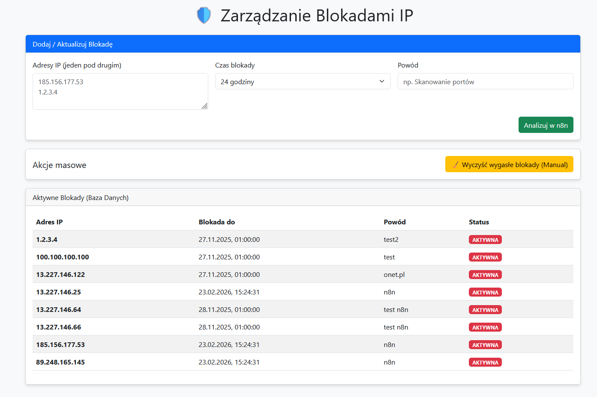
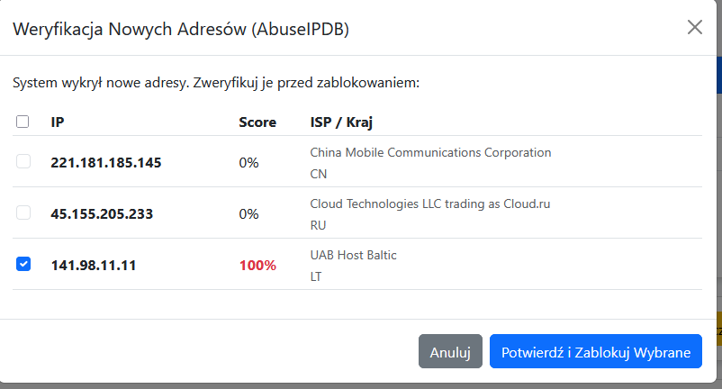

## 🛡️ Custom IP Blocker (Threat Intelligence Dashboard)

Autorska aplikacja typu **Full-Stack**, służąca jako centrum decyzyjne dla blokad sieciowych. Łączy lokalną bazę wiedzy (MySQL) z zewnętrznym wywiadem (AbuseIPDB) przy wsparciu automatyzacji n8n.

### 🏗️ Architektura Hybrydowa

Aplikacja składa się z trzech współpracujących warstw:

1.  **Backend (Python):**
    - Plik `app.py` (Flask).
    - Odpowiada za serwowanie Frontendu (`index.html`).
    - Zarządza bezpośrednimi operacjami na bazie danych MySQL (CRUD dla tabeli blokad).
    - Wystawia API dla Frontendu i webhooków n8n.

2.  **Logic & Enrichment (n8n):**
    - Działa jako "Mózg" operacji.
    - Odbiera zapytania o nowe IP z Pythona.
    - Komunikuje się z **AbuseIPDB API** (pobieranie reputacji/geolokalizacji).
    - Zwraca wzbogacone dane (JSON) z powrotem do Frontendu/Backendu.

3.  **Frontend (JS/HTML):**
    - Interaktywny dashboard dla Administratora.
    - Wizualizuje dane z n8n (np. "Reputation Score: 100%", "Country: CN").
    - Pozwala na podejmowanie decyzji (Przedłuż blokadę / Zablokuj nowy / Ignoruj).

### 🚀 Flow Danych
`Frontend` -> `Python Backend` -> `MySQL (Check)` -> `n8n` -> `AbuseIPDB` -> `Frontend (Decision)`

### 🧪 DVWA (Penetration Testing Lab)

Wystawiona wewnętrznie aplikacja podatna na ataki (SQLi, XSS, Brute Force).
Służy jako **generator "szumu" i realnych alertów** dla Wazuha. To tutaj testuję, czy:
1. Wazuh wykrywa SQL Injection.
2. n8n poprawnie kategoryzuje to jako `WEB_ATTACK`.
3. AI podejmuje decyzję o blokadzie.
